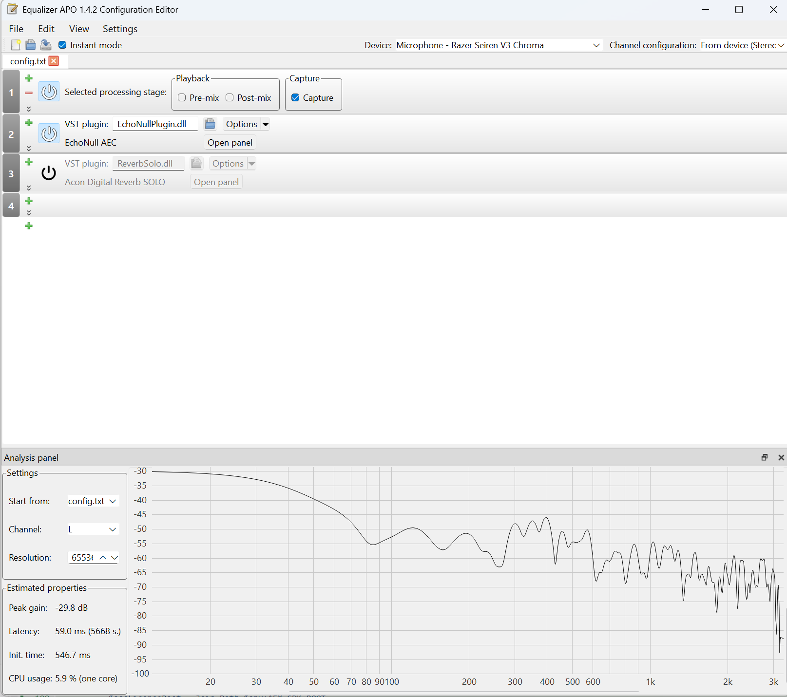
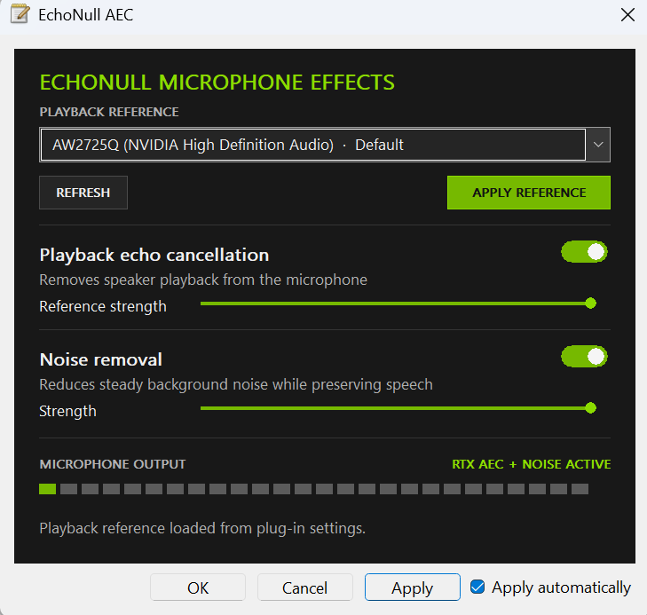

# EchoNull

EchoNull adds NVIDIA NvAFX Acoustic Echo Cancellation (AEC) to an existing
Windows microphone through Equalizer APO. It does not create another microphone,
install an audio driver, or require a virtual audio cable.

Users download one architecture-specific `EchoNullSetup.exe`. It contains the
self-contained `EchoNullPlugin.dll`, installs it into Equalizer APO, and adds a
capture-only configuration block automatically. There is no EchoNull CLI. The
playback selector, AEC and Noise Removal controls, output meter, and runtime
status remain embedded in the plug-in editor.

```text
selected playback endpoint
  -> WASAPI shared-mode loopback (inside EchoNullPlugin.dll)
  -> 48 kHz mono reference timeline

existing microphone endpoint
  -> Equalizer APO capture stage
  -> EchoNullPlugin.dll (NvAFX AEC)
  -> same microphone endpoint, processed in place
```

The installer scopes EchoNull to Equalizer APO's capture pipeline. After
installation, the resulting configuration appears like this in Configuration
Editor:



EchoNull intentionally implements playback echo cancellation followed by
optional NVIDIA Background Noise Removal. Room dereverberation, AGC, gates, and
Studio Voice are outside the project scope.

## Plug-in interface

The embedded interface uses a dark GPU-audio-tool visual language with green
status accents. It contains only controls that belong to the AEC pipeline:



- playback-reference endpoint selector
- AEC on/off switch and reference-strength slider
- Noise Removal on/off switch and strength slider
- live microphone output meter
- reference, GPU/model, bypass, and processing status
- endpoint refresh action

The selector deliberately contains no microphone list. The microphone is the
capture endpoint section where the plug-in was loaded. Playback choices are
filtered to active endpoints that have Equalizer APO's post-mix processing
registered and audio enhancements enabled.

Applying a reference stores the selected endpoint ID in the existing VST
instance's standard `ChunkData`. Equalizer APO's Auto Apply owns that state.
The setup program edits `config.txt` once to create a marked, capture-only
EchoNull block and preserves existing ChunkData during repair or upgrade.
EchoNull never creates a second playback instance and therefore adds no
processing or latency to the playback pipeline.

The live capture instance in `audiodg.exe` publishes its processed output level
and runtime state through a read-only telemetry mapping. It also reports GPU
deadline misses, completed AEC/Noise frames, queue pressure, and output underruns.
The editor reads that mapping, so the meter represents the active microphone
pipeline rather than the Configuration Editor's preview instance. Stale
telemetry is shown as `AUDIO ENGINE OFFLINE`.

## Architecture

The project follows Clean Architecture boundaries:

```text
domain
  audio endpoint and status models
      ^
application
  resampling, timestamp buffers, delay estimation
      ^
infrastructure
  NvAFX, endpoint discovery, WASAPI loopback, cross-session telemetry
      ^
adapter
  one Equalizer APO-compatible plug-in DLL with an embedded Win32 editor
```

Application code has no dependency on Win32, COM, WASAPI, Equalizer APO, or
NVIDIA headers.

## Install

- Windows 10 or 11 x64
- NVIDIA RTX GPU supported by the bundled AFX model
- Equalizer APO with post-mix enabled on the reference playback endpoint and
  capture processing enabled on the existing microphone

1. Download the setup file matching the installed GPU from the latest GitHub
   Release:

   | GPU family | Setup file |
   | --- | --- |
   | GeForce RTX 20 | `EchoNullSetup-Turing-RTX20.exe` |
   | GeForce RTX 30 | `EchoNullSetup-Ampere-RTX30.exe` |
   | GeForce RTX 40 | `EchoNullSetup-Ada-RTX40.exe` |
   | GeForce RTX 50 | `EchoNullSetup-Blackwell-RTX50.exe` |

2. Run setup and choose **Install EchoNull**. It copies the self-contained DLL.
   If EchoNull is already under a capture `Stage`, setup preserves that row and
   the saved plug-in settings, and removes any redundant setup-created
   condition block. Otherwise, setup
   scopes the plug-in with `If: stage == "capture"`; no manual Stage row is
   required. The same setup file can repair, update, or remove EchoNull. Setup
   temporarily stops active services that depend on Windows Audio (including
   vendor audio helpers) and restores them after the plug-in is replaced.
3. Open Equalizer APO Device Selector. Enable capture processing on the existing
   microphone and post-mix processing on playback devices you want listed in
   the selector.
4. Open the embedded panel, choose the playback reference, and press
   **APPLY REFERENCE**.

On first activation, the DLL extracts its embedded vendor payload to an
`EchoNull/<bundle-id>` directory below the host process's Windows temporary
directory. The cache is reused on later starts and a new DLL version receives a
new cache directory. The current AFX runtime is about 1.6 GB, so leave enough
disk space for the audio-service cache.

EchoNull accepts the endpoint's native format. A 96 kHz stereo playback or
capture stream is downmixed and resampled internally to the 48 kHz mono frames
required by NvAFX AEC, then converted back to the capture pipeline's rate.

Noise Removal defaults to off. It becomes available when the release was built
with NVIDIA's 48 kHz Denoiser feature; otherwise enabling it produces the
explicit `NOISE MODEL MISSING` status. Disable the unavailable Noise Removal
option to continue with AEC alone; an incomplete requested chain is not output.

EchoNull keeps NvAFX inference off the `audiodg.exe` real-time callback. A
dedicated MMCSS worker processes fixed 10 ms frames. Both enabled effects stay
on the NVIDIA GPU; there is no CPU fallback or automatic effect shedding.
AEC and Noise Removal share a worker-owned CUDA context where available. The
audio-engine process requests WDDM GPU scheduling class `HIGH` (not `REALTIME`);
the actual class and any denial are logged, and the original class is restored
when the last EchoNull worker stops. This is a scheduling preference, not a
guaranteed GPU reservation. No game, HAGS, driver, or system power setting is changed.
The implementation uses Microsoft's
[process GPU scheduling API](https://learn.microsoft.com/en-us/windows-hardware/drivers/ddi/d3dkmthk/nf-d3dkmthk-d3dkmtsetprocessschedulingpriorityclass)
and NVIDIA's documented
[user CUDA context option](https://docs.nvidia.com/maxine/afx/2.1.0/UseAFXInApps/UseMultipleGPUs.html).

The output lead is 80 ms (20 ms more than v0.1.7), allowing for frame assembly
and resampler lookahead. Results are selected only when audio is actually needed,
rather than discarded early at a separate 40 ms cutoff. A 10 ms inference
overrun is diagnostic only: it does not disable AEC or Noise Removal. If a
result still cannot meet its real output deadline, the affected frame fades
to silence and the panel reports `GPU DEADLINE MISSED · OUTPUT PROTECTED`.
It never substitutes raw microphone audio for a missing or partial GPU result.
This last-resort protection prevents noise/echo leakage but is still an audible
failure, not a claim that arbitrary GPU stalls can be made gap-free.
Both models are also run with silent warm-up frames before capture begins,
so lazy CUDA/TensorRT initialization does not block the first live GPU frame.

Runtime diagnostics are written asynchronously to
`C:\ProgramData\EchoNull\Logs\EchoNull.log`. The file records model/runtime
errors, actual GPU scheduling/context setup, completed effect-frame counts,
peak inference time, protected misses, queue pressure, and buffer counts;
it rotates to `EchoNull.log.1` at 2 MB. File I/O never runs on the audio callback.

The manual `echonull_nvafx_benchmark` and `echonull_pipeline_benchmark` targets
use nonzero synthetic input without opening audio devices or recording speech.
The latter exercises the real worker, queues, 96 kHz stereo conversion, output
deadline policy, and optional injected GPU-worker delays. For bounded synthetic
GPU contention, `tools/benchmark_gpu_contention.py` requires a CUDA-enabled
PyTorch installation; it logs observed utilization and stops at 80 C or 90 seconds.
See [the local validation results](docs/gpu-contention-validation.md) for measured
frame counts, timing, reproduction commands and test limitations.

## Build

```powershell
$env:AFX_SDK_ROOT = "C:\path\to\AFX-SDK"
cmake -S . -B build -A x64 -DAFX_SDK_ROOT="$env:AFX_SDK_ROOT" -DECHONULL_NVAFX_ARCHITECTURES=blackwell
cmake --build build --config Release --parallel
ctest --test-dir build -C Release --output-on-failure
```

The packer appends the NvAFX DLLs, architecture-specific AEC and Denoiser
models, and license files to the plug-in PE image, then embeds that DLL in
`EchoNullSetup.exe`. Both local outputs are copied to the repository root and
intentionally gitignored. Test executables remain in the build directory only.

Builds without the proprietary SDK still compile and run the tests. The AEC
instance then reports a GPU/model error and safely bypasses processing.

## CI and releases

`.github/workflows/ci.yml` builds and tests every push and pull request without
proprietary assets. `.github/workflows/release.yml` runs for `v*` tags or manual
dispatch, downloads AFX SDK 2.1.0 plus 48 kHz AEC and Denoiser models for
Turing, Ampere, Ada, and Blackwell from NGC, runs the tests, and packages four
separate self-contained setup files. Users download only the model generation
needed by their GPU. Every setup file receives a SHA-256 sidecar.

Release builds require the repository Actions secret `NGC_CLI_API_KEY`. Keep it
only in GitHub Secrets; never place it in a workflow, local config committed to
Git, or command output.

## Equalizer APO state

The playback selection and effect controls are serialized by the plug-in as
VST `ChunkData`, so Auto Apply can persist them as part of the one existing
capture-scoped plug-in line. Setup backs up the original `config.txt`, owns only
the block between its EchoNull markers, and leaves unrelated filters in place.
If the playback reference is stopped, unavailable, or the NVIDIA model cannot
load, the capture instance bypasses AEC rather than muting the microphone.

## Limitations

- Applications using ASIO, WASAPI exclusive mode, RAW mode, or another path
  that bypasses Windows system effects also bypass EchoNull.
- Equalizer APO must be active on the microphone capture endpoint. The selector
  currently lists only playback endpoints where post-mix is also enabled.
- The first implementation targets normal mono/stereo endpoint layouts. A
  multichannel endpoint needs additional host-instance validation.
- Equalizer APO loads third-party processing code under `audiodg.exe`; follow
  its documented protected-audio and compatibility tradeoffs.

## Independent implementation and licensing

EchoNull is an independent implementation and is not a fork of Equalizer APO.
It uses NVIDIA's public AFX API and the clean-room, BSD-3-Clause
[`Xaymar/vst2sdk`](https://github.com/Xaymar/vst2sdk) headers at a pinned revision
for binary interoperability with Equalizer APO's built-in VST 2 host. See
`THIRD_PARTY_NOTICES.md`.

Stock Equalizer APO 1.4.2 does not provide a VST 3 import path. Replacing this
narrow VST 2 boundary would require either a modified Equalizer APO fork or a
separately installed native APO package, so EchoNull deliberately keeps the
host adapter isolated from its AEC application and infrastructure layers.

Release DLLs embed the selected AFX runtime, models, dependencies, and license
documents; the source repository does not commit those vendor binaries. They
remain governed by NVIDIA's terms. Review those terms and the
[NVIDIA Maxine branding guidelines](https://www.nvidia.com/maxine-sdk-guidelines)
before redistributing a binary package.
